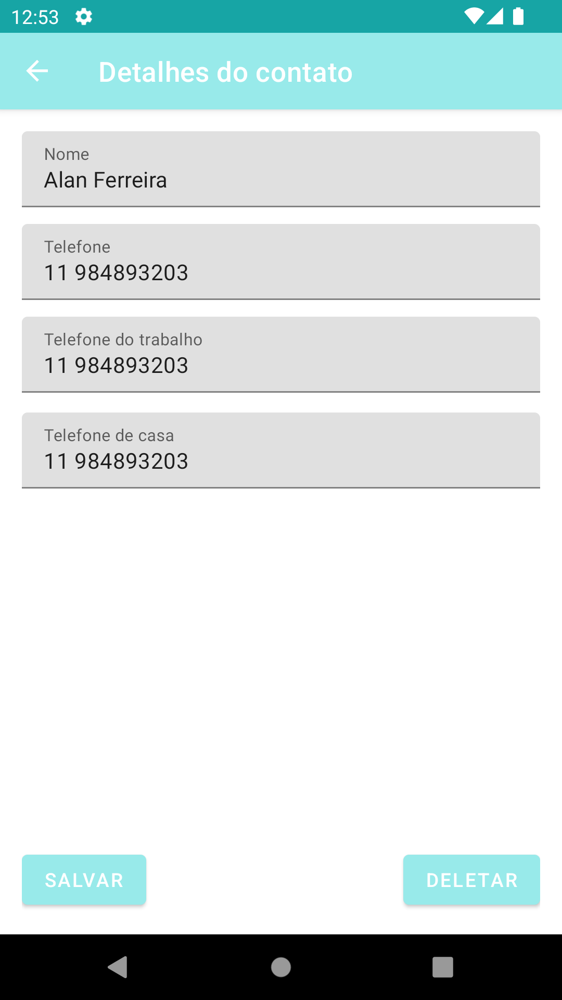

# Contatos GNV

Esse é um aplicativo de contatos básico, que utiliza integração com o banco de dados atráves do padrão de projeto DAO.
Feito para a disciplina de Programação Mobile.

Capturas de tela:

  
  
  

